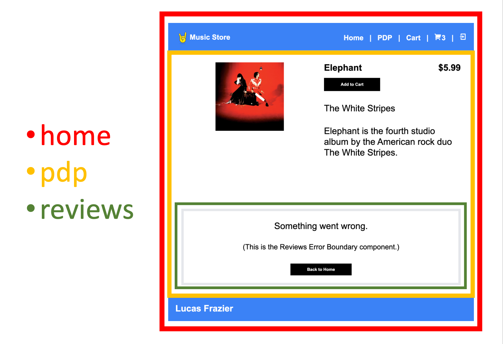

# Module Federation Example

## About The Project

The purpose of this project is to demonstrate an example of a [Micro-Frontend Architecture](https://micro-frontends.org/) powered by [Webpack 5 Module Federation](https://webpack.js.org/concepts/module-federation/). This reference architecture is to demonstrate the capabilities and is not meant as a production grade example.

Micro-Frontend Architecture enables teams to work independently, in parallel.

Module Federation is how we stitch together the work done by these independent teams, at runtime.

In the context of this project, the `home` app is the _host_, while the `pdp` and `cart` apps are the _remotes_. While each app runs on a separate port, http://localhost:3000 is where we will see our app being stitched together at runtime.

Please see the [Notes](#notes) and [Resources](#resources) sections at the end of this document for some additional thoughts and materials I put together while researching and building this project.

In this reference architecture I am building a e-commerce application using a Cart, a PDP (Product Display Page), and a Login to demonstrate state management, module federation, and error handling.

<br>

---

<br>

## Architecture

### An example of how modules are stitched together in this project (http://localhost:3000/product/2):

<br>



In the illustration above I highlight how the components are stitched together.

- The `home` application is the **host**
  - `home` pulls in the remote `<PDPContent />` module that is exposed by the `PDP` application
- The `PDP` application pulls in the remote `<ReviewsContent />` module that is exposed by the `Reviews` application
  - `<ReviewsContent />` is considered a child component of the `<PDPContent />` module and error handling will need be to done in the `<PDPContent />` module in the event the `<ReviewsContent />` module could not be rendered.

<br>

### Built With

- Frontend(s)
  - React 18
  - React Router
  - Webpack 5
    - Module Federation Plugin
  - Zustand
    - See ADR under `adr` directory
  - Tailwind
- Backend
  - Nest
  - TypeScript

<br>

---

<br>

## Getting Started

Follow theses steps to get the project up and running locally.

### Prerequisites

This is an example of how to list things you need to use the software and how to install them.

- npm

  ```sh
  npm install -g npm@latest
  ```

### Installation

\*NOTE: In the project's current state, all apps need to be running in order for any single app to work. Once you have gone through the installation steps, refresh each page if you are seeing blank screens.

1. Clone the repo

   ```sh
   git clone https://github.com/LucasFrazier/module-federation-example.git
   ```

1. For each directory (`home`, `pdp`, `cart`, `reviews`, `server` do the following.
1. `cd` into the directory
   ```sh
   cd <directory>
   ```
1. run `npm install`
   ```sh
   npm install
   ```
1. For `home`, `pdp`, `cart`, & `reviews` run `npm run build`
   ```sh
   npm run build
   ```
1. run `npm start`
   ```sh
   npm start
   ```
1. Refresh browser windows

<br>

---

<br>

## Usage

### Basics

The project mimics an ecommerce site experience and consists of 5 separate applications: home, pdp, cart, reviews, and server.

In this project, `home` is the _host_, while `pdp`, `cart`, and `reviews` are the _remotes_

Each application runs on a separate port:

- home: http://localhost:3000
- pdp: http://localhost:3001
- cart: http://localhost:3002
- reviews: http://localhost:3003
- server: http://localhost:8080

Once all apps are running, navigate to http://localhost:3000 to begin using the stitched together site.

Most of the magic is happening in the `webpack.config.js` files within the `home`, `pdp`, `cart`, and `reviews` apps. Looking at the `ModuleFederationPlugin` settings in each file will show you what is being exposed (`exposes: {...}`- see [cart's webpack](https://github.com/LucasFrazier/module-federation-example/blob/main/cart/webpack.config.js#L51) ) and what is being consumed (`remotes: {...}`).

The exposed data becomes available via a `remoteEntry.js` file that Webpack creates in the `dist` directory at the root of each app.

For example, in the context of our application, `pdp` exposes `<PDPContent />`, and then `home` hosts that content when the user navigates to `/product/:id`.

A _basic_ example really is that straightforward. If you know how to import/export, you know how to use Module Federation.

<br>

### Actions You Can Take

You can use the username, `sally`, and the password, `123` to log in, or you can remain logged out.

You can add products to your cart from the Home and PDP pages. You can view your cart on the Cart page or at any time using the cart icon in the global header.

- Your cart will remain in state as you navigate around the site, but the data will be cleared on refresh
- I have also implemented state "freshness" controls
  - If a user navigates to /cart or clicks the cart icon in the top nav, a "freshness" check is run
  - If a user is logged in and the timestamp on the cart is older than 5 seconds, I fetch fresh cart data from the server
  - You can test this by logging in, adding some new products to cart, and waiting 5 seconds
    - Your cart will be reset to two items the next time you navigate to /cart or click the cart icon

<br>

### Error Handling

If you navigate to http://localhost:3000/product/2, you will see that the `reviews` module is broken.

I am catching this error using an [Error Boundary](https://reactjs.org/docs/error-boundaries.html) component.

What to do about the error

- You can fix the error by commenting out or removing `{x.toString()}` in `reviews/src/Reviews.jsx`
- You can remove the `<ErrorBoundary />` that wraps `<Reviews />`
  - If you do this, you will see the PDP `<ErrorBoundary />` catch the error
    - You could take this even further, removing the `<ErrorBoundary />` that wraps `<PDPContent />`
      - In which case you will see the Home `<ErrorBoundary />` catch the error

\*Note: I have a [Roadmap](#roadmap) item for creating / exposing a reusable Error Boundary component in the `home` app

<br>

---

<br>

## Roadmap

- [x] Implement State Management Solution
- [x] Implement Error Handling
- [x] Upgrade Tailwind CSS v2 -> v3
- [ ] Utilize Quantity Property on Cart Items
- [ ] Create new app template
- [ ] Create / Expose reusable Error Boundary component in home app
- [ ] Create global config for Tailwind CSS

<br>

---

<br>

## Notes

- You can use Module Federation to share _any_ kind of JavaScript
- Modules can be updated at runtime
- State Management can be implemented in all the most common ways
  - Prop Drilling, Context, Zustand, Redux, etc.
- CSS is not something you can share across Module Federation
  - Must be JS or CSS-in-JS
- Error Handling can be accomplished by using a combination of
  - [Promise-Based Dynamic Imports](https://webpack.js.org/concepts/module-federation/#dynamic-remote-containers)
  - React Lazy, Suspense, Fallbacks, and Error Boundaries
  - You need to create "Resilient Components"
- Routes can be controlled under a namespace
  - In this project, this is enforced by the host app, `home`

## Resources

- Documentation
  - https://webpack.js.org/concepts/module-federation/
- Video
  - [Micro-Frontends Course - Beginner to Expert](https://youtu.be/lKKsjpH09dU)
- Podcast
  - [Zack Jackson - Module Federation](https://devtools.fm/episode/30)
    - YouTube video also available, but it's just talking
- Examples on GitHub
  - [Module Federation Examples](https://github.com/module-federation/module-federation-examples)

<br>

---

<br>

[Back to Top](#module-federation-example)
